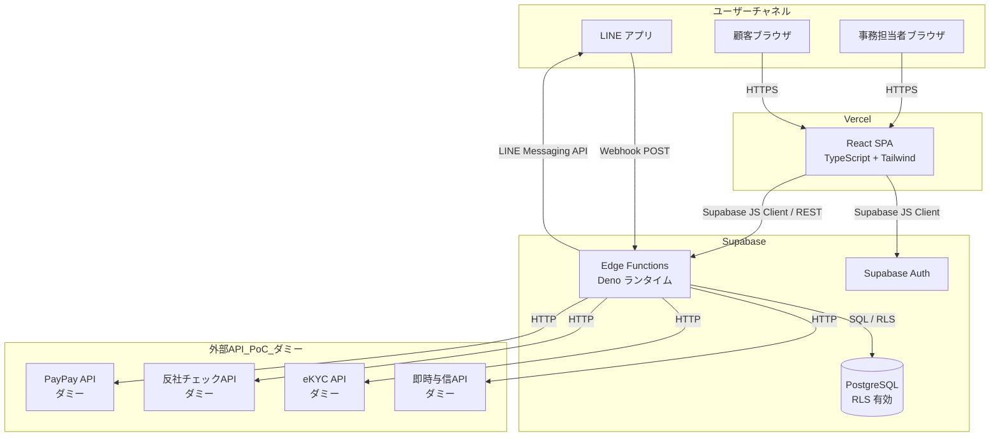
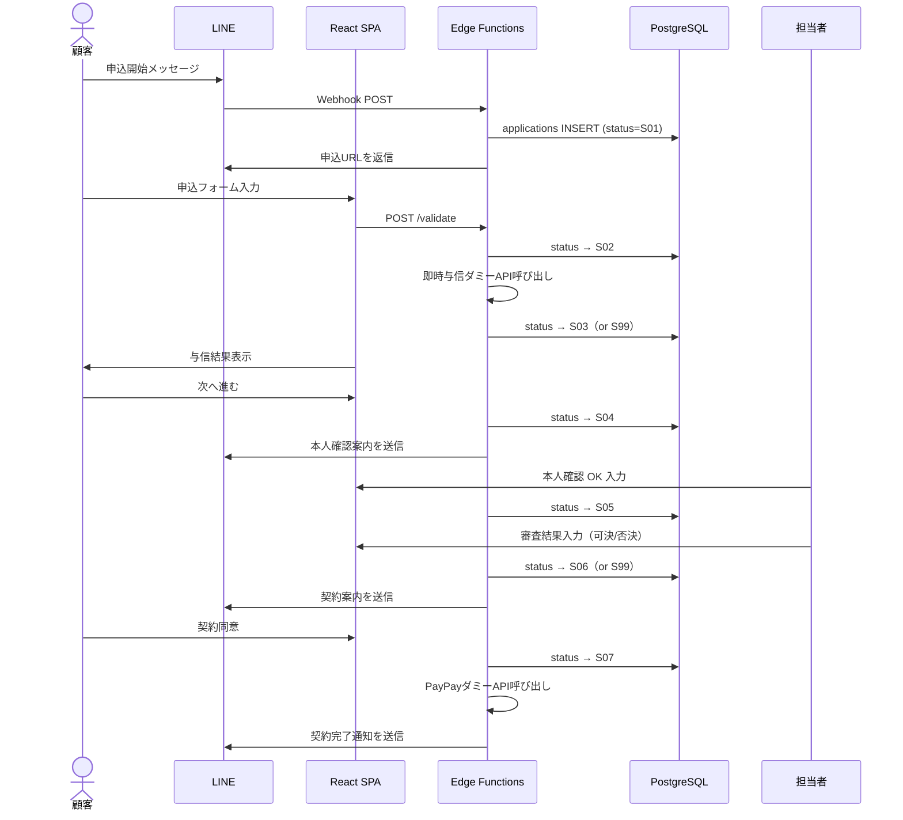

# アーキテクチャ設計

要件定義（`01_requirements.md`）をベースにした個人開発向けシンプル構成。

---

## 技術スタック

- **フロントエンド**: React 18 + TypeScript + Vite + Tailwind CSS
- **バックエンド**: Supabase Edge Functions（Deno ランタイム）
- **データベース**: Supabase PostgreSQL（RLS 有効）
- **認証**: Supabase Auth（メール／パスワード＋管理者ロール）
- **インフラ**: Vercel（フロントエンド） + Supabase（バックエンド／DB）
- **その他**: LINE Messaging API（Webhook）、PayPay API（PoC: ダミー応答）

---

## システム構成図



---

## 選択理由

- **Supabase Edge Functions**: バックエンドを別途サーバー構築せず Supabase 内で完結できる。LINE Webhook の受信・外部API呼び出し・DB操作をすべて Edge Functions に集約し、管理コストを最小化する。
- **Supabase PostgreSQL + RLS**: 顧客情報・申込情報など個人情報を扱うため、Row Level Security で行レベルのアクセス制御を強制する。追加のアクセス制御ミドルウェアが不要になる。
- **Supabase Auth**: メール／パスワード認証と JWT 発行が無料枠で利用可能。管理者ロールを `user_metadata` で管理することで追加サービス不要。
- **React + Vite**: 既存プロジェクトのベース構成を踏襲。Vite によるビルド高速化でPoC開発の反復速度を上げる。
- **Vercel**: GitHub 連携で自動デプロイ。無料枠でPoC規模は十分。独自ドメインも無料で設定可能。
- **Tailwind CSS**: ユーティリティクラスで素早くUIを組める。既存 `tailwind.config.js` の設定を活用する。

---

## 初期コスト（月額）

| サービス | プラン | 金額 |
|---|---|---|
| Supabase | Free（DB 500MB・Edge Functions 500万回/月・帯域 5GB） | ¥0 |
| Vercel | Hobby（帯域 100GB/月・デプロイ無制限） | ¥0 |
| LINE Messaging API | Messaging API（Webhook 受信・月1,000通まで無料） | ¥0 |
| **合計** | | **¥0 / 月** |

> **備考**
> - PoC規模（〜1,000ユーザー体験デモ）では無料枠に収まる想定。
> - PayPay API はPoC期間中ダミー応答のため、本番移行時に別途契約が必要。
> - Supabase の無料枠超過時は Pro プラン（約 $25/月）へアップグレード。

---

## ディレクトリ構成（フロントエンド）

```
src/
├── components/       # 再利用可能なUIコンポーネント
│   ├── ui/           # 汎用UI（Button, Input, Badge など）
│   └── application/  # 申込フロー固有コンポーネント
├── pages/            # ページコンポーネント（ルート単位）
│   ├── customer/     # 顧客向け画面（申込〜契約）
│   └── admin/        # 事務担当者向け画面
├── lib/
│   ├── supabase.ts   # Supabase クライアント（シングルトン）
│   └── api.ts        # Edge Functions 呼び出しラッパー
├── types/
│   └── application.ts # 申込・業務状態の型定義
└── config.ts         # 外部リンク・定数の集約
```

## Edge Functions 構成（バックエンド）

```
supabase/functions/
├── line-webhook/         # LINE Webhook 受信・メッセージ送信
├── applications/         # 申込 CRUD（API-01）
├── validate/             # バリデーション（API-02）
├── pre-credit/           # 即時与信ダミー（API-03）
├── identity-verification/ # 本人確認ダミー（API-05）
├── review/               # マニュアル審査反映（API-07）
├── decision/             # 決裁確定（API-08）
└── contract/             # 契約・会員化（API-09）
```

---

## 業務状態と処理フロー


