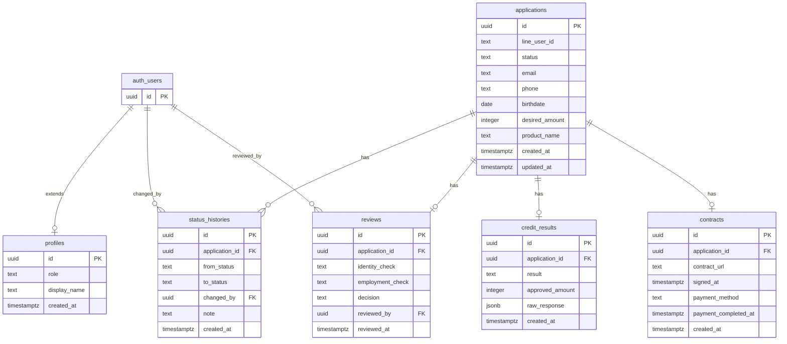

# データベース設計

要件定義（`01_requirements.md`）・アーキテクチャ（`02_architecture.md`）をベースとした最小構成。
Supabase PostgreSQL + RLS（Row Level Security）を前提とする。

---

## テーブル一覧

| テーブル名 | 概要 |
|---|---|
| **profiles** | 事務担当者プロファイル（`auth.users` の拡張） |
| **applications** | 申込情報・現在の業務状態を管理するメインテーブル |
| **status_histories** | 業務状態の遷移ログ（監査・デバッグ用） |
| **credit_results** | 即時与信APIのレスポンス保存（PoC: ダミー結果） |
| **reviews** | 事務担当者によるマニュアル審査記録 |
| **contracts** | 契約・PayPay決済情報 |

---

## 主要テーブル DDL

### profiles テーブル

事務担当者の情報を管理する。Supabase Auth の `auth.users` を拡張する形で1:1で紐付ける。

```sql
create table profiles (
  id           uuid primary key references auth.users(id) on delete cascade,
  role         text        not null default 'admin'
                           check (role in ('admin')),
  display_name text,
  created_at   timestamptz not null default now()
);

-- RLS: 自分自身のレコードのみ参照・更新可
alter table profiles enable row level security;

create policy "自分自身のプロファイルを参照"
  on profiles for select
  using (auth.uid() = id);

create policy "自分自身のプロファイルを更新"
  on profiles for update
  using (auth.uid() = id);
```

---

### applications テーブル

申込のライフサイクル全体を管理するメインテーブル。
`status` が業務状態（S01〜S99）を保持し、すべての処理の起点となる。

```sql
create table applications (
  id             uuid        primary key default gen_random_uuid(),
  line_user_id   text        not null,
  status         text        not null default 'S01'
                             check (status in ('S01','S02','S03','S04','S05','S06','S07','S99')),
  -- 申込入力項目（S02→S03 Entry条件）
  email          text,
  phone          text,
  birthdate      date,
  desired_amount integer,    -- 借入希望額（円）
  product_name   text,
  -- メタデータ
  created_at     timestamptz not null default now(),
  updated_at     timestamptz not null default now()
);

-- updated_at 自動更新トリガー
create or replace function update_updated_at()
returns trigger language plpgsql as $$
begin
  new.updated_at = now();
  return new;
end;
$$;

create trigger trg_applications_updated_at
  before update on applications
  for each row execute procedure update_updated_at();

-- RLS: 顧客は自分の申込のみ、adminは全件
alter table applications enable row level security;

create policy "顧客は自分の申込を参照"
  on applications for select
  using (line_user_id = current_setting('request.jwt.claims', true)::json->>'line_user_id');

create policy "adminは全件参照"
  on applications for all
  using (
    exists (
      select 1 from profiles
      where id = auth.uid() and role = 'admin'
    )
  );
```

---

### status_histories テーブル

業務状態の遷移をすべて記録する。
システム自動遷移の場合は `changed_by` が NULL になる。

```sql
create table status_histories (
  id             uuid        primary key default gen_random_uuid(),
  application_id uuid        not null references applications(id) on delete cascade,
  from_status    text,       -- 遷移元（初回遷移時は NULL）
  to_status      text        not null,
  changed_by     uuid        references auth.users(id), -- NULL = システム自動
  note           text,       -- 遷移理由・補足（任意）
  created_at     timestamptz not null default now()
);

-- RLS: adminのみ参照可
alter table status_histories enable row level security;

create policy "adminのみ参照"
  on status_histories for select
  using (
    exists (
      select 1 from profiles
      where id = auth.uid() and role = 'admin'
    )
  );
```

---

### credit_results テーブル

即時与信API（PoC: ダミー）のレスポンスを保存する。
`raw_response` にダミーAPIのレスポンスをそのまま格納し、デバッグを容易にする。

```sql
create table credit_results (
  id              uuid        primary key default gen_random_uuid(),
  application_id  uuid        not null unique references applications(id) on delete cascade,
  result          text        not null check (result in ('approved', 'rejected')),
  approved_amount integer,    -- result = 'approved' の場合のみセット（円）
  raw_response    jsonb,      -- [PoC] ダミーAPIレスポンスをそのまま保存
  created_at      timestamptz not null default now()
);

-- RLS: adminのみ参照可
alter table credit_results enable row level security;

create policy "adminのみ参照"
  on credit_results for select
  using (
    exists (
      select 1 from profiles
      where id = auth.uid() and role = 'admin'
    )
  );
```

---

### reviews テーブル

事務担当者によるマニュアル審査（S05）の記録。
本人確認補完・在籍確認・審査結果の3項目を保持する。

```sql
create table reviews (
  id                 uuid        primary key default gen_random_uuid(),
  application_id     uuid        not null unique references applications(id) on delete cascade,
  -- 本人確認補完（S05 マニュアル作業）
  identity_check     text        check (identity_check in ('ok', 'ng')),
  -- 在籍確認（S05 マニュアル作業）
  employment_check   text        check (employment_check in ('ok', 'ng')),
  -- 審査結果：可決 → S06、否決 → S99
  decision           text        not null check (decision in ('approved', 'rejected')),
  reviewed_by        uuid        not null references auth.users(id),
  reviewed_at        timestamptz not null default now()
);

-- RLS: adminのみ参照・操作可
alter table reviews enable row level security;

create policy "adminのみ操作"
  on reviews for all
  using (
    exists (
      select 1 from profiles
      where id = auth.uid() and role = 'admin'
    )
  );
```

---

### contracts テーブル

顧客の契約同意（S06→S07）と PayPay 決済結果を管理する。
PoC では `contract_url` は固定ダミー URL を使用する。

```sql
create table contracts (
  id                    uuid        primary key default gen_random_uuid(),
  application_id        uuid        not null unique references applications(id) on delete cascade,
  contract_url          text        not null, -- [PoC] 固定ダミーURL
  signed_at             timestamptz,          -- 顧客が「同意/署名した」操作を行った日時
  payment_method        text        default 'paypay'
                                    check (payment_method in ('paypay')),
  payment_completed_at  timestamptz,          -- PayPay 決済完了日時
  created_at            timestamptz not null default now()
);

-- RLS: 顧客は自分の契約のみ参照、adminは全件
alter table contracts enable row level security;

create policy "顧客は自分の契約を参照"
  on contracts for select
  using (
    exists (
      select 1 from applications a
      where a.id = application_id
        and a.line_user_id = current_setting('request.jwt.claims', true)::json->>'line_user_id'
    )
  );

create policy "adminは全件操作"
  on contracts for all
  using (
    exists (
      select 1 from profiles
      where id = auth.uid() and role = 'admin'
    )
  );
```

---

## リレーション

```
profiles.id               → auth.users.id          (1:1  事務担当者プロファイル)
applications.id           → status_histories.application_id  (1:N  状態遷移ログ)
applications.id           → credit_results.application_id    (1:1  即時与信結果)
applications.id           → reviews.application_id           (1:1  審査記録)
applications.id           → contracts.application_id         (1:1  契約・決済情報)
auth.users.id             → status_histories.changed_by      (1:N  担当者が遷移を実行)
auth.users.id             → reviews.reviewed_by              (1:N  担当者が審査を実施)
```

---

## ER 図



---

## 補足

- `applications.status` は業務状態の **現在値のみ** を持つ。遷移ログは `status_histories` で管理する。
- `credit_results`・`reviews`・`contracts` は `applications` に対して **1:1**（`unique` 制約）。重複登録をDB レベルで防止する。
- 審査否決理由は `reviews.decision = 'rejected'` のみ保持し、顧客向けAPIには返さない（要件定義準拠）。
- PoC 終了後に本番移行する際は、監査ログの網羅・保存期間ポリシー・個人情報の暗号化を別途設計する。
