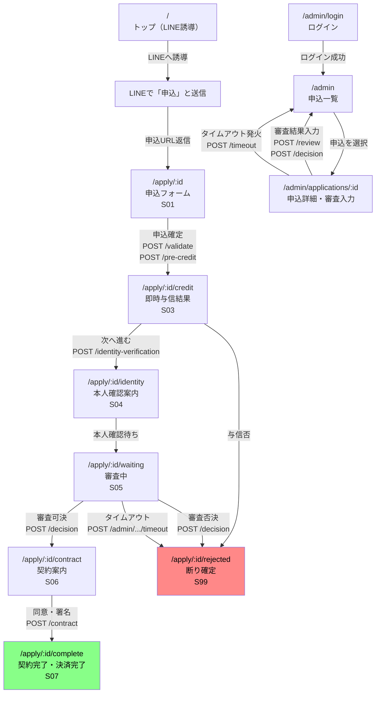

# サイトマップ設計

要件定義（`01_requirements.md`）・API設計（`04_api.md`）をベースとした画面一覧と遷移定義。

---

## サイトマップ（ページ一覧）

### ページ（顧客向け・LINE起点）

| URL | 画面名 | 対応状態 |
|---|---|---|
| `/` | トップ（LINE誘導） | — |
| `/apply/:id` | 申込フォーム | S01 |
| `/apply/:id/credit` | 即時与信結果 | S03 |
| `/apply/:id/identity` | 本人確認案内 | S04 |
| `/apply/:id/waiting` | 審査中（待機） | S05 |
| `/apply/:id/contract` | 契約案内 | S06 |
| `/apply/:id/complete` | 契約完了・決済完了 | S07 |
| `/apply/:id/rejected` | 断り確定 | S99 |

### ページ（事務担当者向け）

| URL | 画面名 | 対応状態 |
|---|---|---|
| `/admin/login` | ログイン | — |
| `/admin` | 申込一覧ダッシュボード | 全状態 |
| `/admin/applications/:id` | 申込詳細・審査入力 | S05 |

---

## 画面遷移図

---

## 主要画面の目的と要素

### `/`（トップ）
- **目的**: LINE で申込を開始するよう顧客を誘導する
- **要素**:
  - サービス説明（ローンの概要・特徴）
  - LINE 友だち追加ボタン / QR コード
  - 注意事項（PoC デモである旨の表示）

---

### `/apply/:id`（申込フォーム・S01）
- **目的**: LINE 経由で受け取った申込URLで入力フォームを表示し、申込を確定する
- **要素**:
  - 入力フォーム（メールアドレス・携帯番号・生年月日・借入希望額・商品名）
  - リアルタイムバリデーションエラー表示
  - 「申込確定」ボタン → `POST /validate` → `POST /pre-credit` を連続呼び出し

---

### `/apply/:id/credit`（即時与信結果・S03）
- **目的**: 即時与信の結果（仮借入可能額）を顧客に提示する
- **要素**:
  - 与信可の場合: 仮借入可能額の表示、「本人確認へ進む」ボタン
  - 与信否の場合: 断りメッセージ表示（理由は非開示）→ `/apply/:id/rejected` へ自動遷移

---

### `/apply/:id/identity`（本人確認案内・S04）
- **目的**: 本人確認の手続きを案内し、完了を待機させる
- **要素**:
  - 本人確認の手順説明
  - 書類アップロードエリア（**[PoC] 未実装表示**）
  - 審査中への自動遷移案内（担当者の確認後に連絡）

---

### `/apply/:id/waiting`（審査中・S05）
- **目的**: 審査中であることを顧客に伝え、結果を待たせる
- **要素**:
  - 審査中ステータス表示
  - 「結果はLINEでお知らせします」の案内
  - ステータス確認ボタン（`GET /status` でポーリング）

---

### `/apply/:id/contract`（契約案内・S06）
- **目的**: 審査通過後、契約書を提示し顧客の同意を取得する
- **要素**:
  - 契約書PDFリンク（[PoC] 固定ダミーURL）
  - 契約内容サマリー（借入額・返済条件）
  - 「同意して署名する」ボタン → `POST /contract`

---

### `/apply/:id/complete`（契約完了・S07）
- **目的**: 契約完了と PayPay 決済完了を顧客に通知する
- **要素**:
  - 完了メッセージ（「ご契約ありがとうございました」）
  - PayPay 決済完了の確認表示
  - LINE に戻るボタン

---

### `/apply/:id/rejected`（断り確定・S99）
- **目的**: 審査断りを顧客に伝える（理由は非開示）
- **要素**:
  - 断りメッセージ（理由は記載しない・要件定義準拠）
  - 問い合わせ先の案内
  - LINE に戻るボタン

---

### `/admin/login`（管理者ログイン）
- **目的**: 事務担当者が Supabase Auth でログインする
- **要素**:
  - メールアドレス・パスワード入力フォーム
  - ログインボタン

---

### `/admin`（申込一覧）
- **目的**: 全申込の一覧を確認し、対応が必要な申込を素早く把握する
- **要素**:
  - 申込一覧テーブル（申込ID・状態バッジ・商品名・希望額・LINE ID・更新日時）
  - 状態でフィルタ（`GET /admin/applications?status=S05`）
  - 申込行クリックで詳細へ遷移

---

### `/admin/applications/:id`（申込詳細・審査入力）
- **目的**: 申込内容の確認と審査結果の入力を1画面で完結させる
- **要素**:
  - 申込情報セクション（入力内容・ダミーAPI結果）
  - 審査入力フォーム（本人確認補完 OK/NG・在籍確認 OK/NG・可決/否決）→ `POST /review` → `POST /decision`
  - タイムアウト擬似発火ボタン（S04 の場合のみ表示） → `POST /timeout`
  - 状態遷移ログ（`status_histories` テーブルから表示）

---

## URL 設計ルール

| ルール | 理由 |
|---|---|
| 顧客向けは `/apply/:id` 配下に統一 | LINE から渡される申込ID（UUID）を URL に含め、セッション不要でページ復元できる |
| 管理者向けは `/admin` 配下に統一 | フロントエンドのルートガードで admin ロールチェックをまとめて適用できる |
| 状態ごとにパスを分ける（`/credit`・`/identity` 等） | ブラウザバックで前の状態に戻れないよう、状態を URL で明示して制御しやすくする |
| 動詞を URL に含めない（`/apply/:id/contract` であり `/apply/:id/sign` ではない） | RESTful の原則に従いリソース名で統一する |

---

## 指針

- **顧客フローは LINE 起点で完結**: トップページは LINE 誘導のみ。フォームは LINE から届いた URL で直接開く設計にし、会員登録フローを省く。
- **状態に応じてリダイレクト**: `/apply/:id` にアクセスした際、DB の現在状態を見て適切なパス（`/credit`・`/identity` 等）へ自動リダイレクトする。戻り・スキップ操作を防止する。
- **管理者画面はシングルページ完結**: 申込詳細＋審査入力を1画面にまとめ、画面遷移を最小化して担当者の操作ステップを減らす。

---

## 運用観点

- 外部リンク・問い合わせURL・LINE 公式アカウントURLなどの定数は `src/config.ts` に集約し、コード内にハードコードしない。
- PoC 終了後に本番ドメインへ切り替える際は `src/config.ts` の `BASE_URL` のみ変更する。
- `/admin` 配下はルートガードで `profiles.role = 'admin'` を必ず確認し、未認証・一般ユーザーは `/admin/login` へリダイレクトする。
